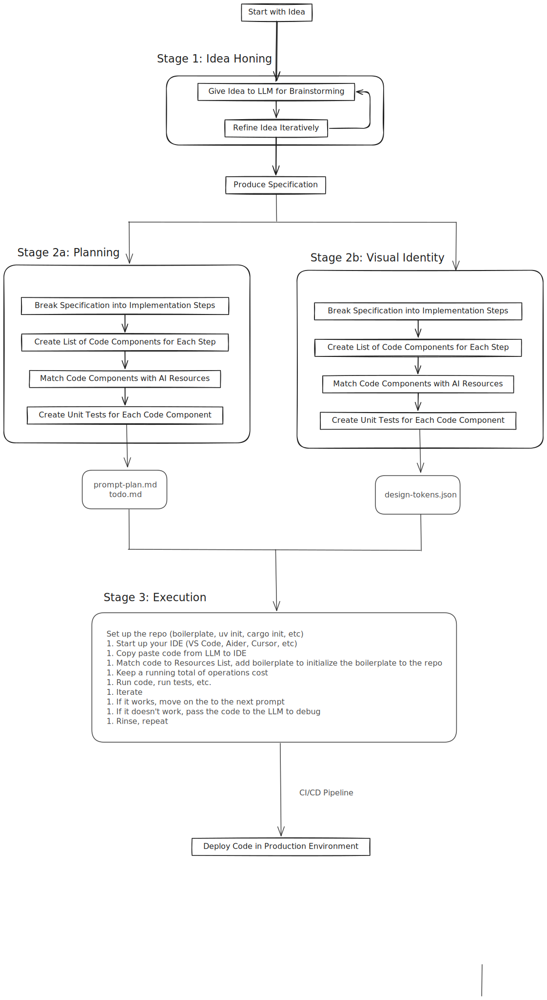

# Static Prompts

These are prompts for greenfield app generation using an LLM provided by Harper Reed at:
[Harper's Blog](https://harper.blog/2025/02/16/my-llm-codegen-workflow-atm/)

## Stage 1: Idea Honing

### Brainstorm Prompts

> Ask me one question at a time so we can develop a thorough, step-by-step spec for this idea. Each question should build on my previous answers, and our end goal is to have a detailed specification I can hand off to a developer. Let’s do this iteratively and dig into every relevant detail. Remember, only one question at a time.
>
> Here’s the idea:
>
> <IDEA>

### Spec generation prompt

> Now that we’ve wrapped up the brainstorming process, can you compile our findings into a comprehensive, developer-ready specification? Include all relevant requirements, architecture choices, data handling details, error handling strategies, and a testing plan so a developer can immediately begin implementation.

The output is saved as `spec.md`

## Stage 2a: Planning
Take the spec and pass it to a reasoning LLM (o1*, o3*, *r1)
This is the TDD prompt

### TDD style development

> Draft a detailed, step-by-step blueprint for building this project. Then, once you have a solid plan, break it down into small, iterative chunks that build on each other. Look at these chunks and then go another round to break it into small steps. Review the results and make sure that the steps are small enough to be implemented safely with strong testing, but big enough to move the project forward. Iterate until you feel that the steps are right sized for this project.
>
> From here you should have the foundation to provide a series of prompts for a code-generation LLM that will implement each step in a test-driven manner. Prioritize best practices, incremental progress, and early testing, ensuring no big jumps in complexity at any stage. Make sure that each prompt builds on the previous prompts, and ends with wiring things together. There should be no hanging or orphaned code that isn't integrated into a previous step.
>
> Make sure and separate each prompt section. Use markdown. Each prompt should be tagged as text using code tags. The goal is to output prompts, but context, etc is important as well.

> <SPEC>

### Non-tdd Prompt

> Draft a detailed, step-by-step blueprint for building this project. Then, once you have a solid plan, break it down into small, iterative chunks that build on each other. Look at these chunks and then go another round to break it into small steps. review the results and make sure that the steps are small enough to be implemented safely, but big enough to move the project forward. Iterate until you feel that the steps are right sized for this project.
>
> From here you should have the foundation to provide a series of prompts for a code-generation LLM that will implement each step. Prioritize best practices, and incremental progress, ensuring no big jumps in complexity at any stage. Make sure that each prompt builds on the previous prompts, and ends with wiring things together. There should be no hanging or orphaned code that isn't integrated into a previous step.
>
> Make sure and separate each prompt section. Use markdown. Each prompt should be tagged as text using code tags. The goal is to output prompts, but context, etc is important as well.
>
> <SPEC>

### Result
The output of the prompt is saved as `prompt_plan.md`
It can be used as the seed for a development session with tools like **Aider**, **Cursor**, etc.

### Check-list Prompt
Also have it output a `todo.md` that can be checked off.

> Can you make a `todo.md` that I can use as a checklist? Be thorough.

## Stage 2b: Identity Kit

Take the spec, with it's detailed description of the functionality to be provided and generate a set of Design Tokens that provide a visual vocabulary that matches the sentiment expressed in the functionality provided to the end user.  It should be a coherent identity that can be used on web sites, marketing materials, business cards, and advertising campaigns.

## Stage 3: Execution

1. Set up the repo (boilerplate, uv init, cargo init, etc)
1. Start up your IDE (VS Code, Aider, Cursor, etc)
1. Copy paste code from LLM to IDE
1. Match code to Resources List, add boilerplate to initialize the boilerplate to the repo
1. Keep a running total of operations cost
1. Run code, run tests, etc.
1. Iterate
1. If it works, move on the to the next prompt
1. If it doesn't work, pass the code to the LLM to debug
1. Rinse, repeat
